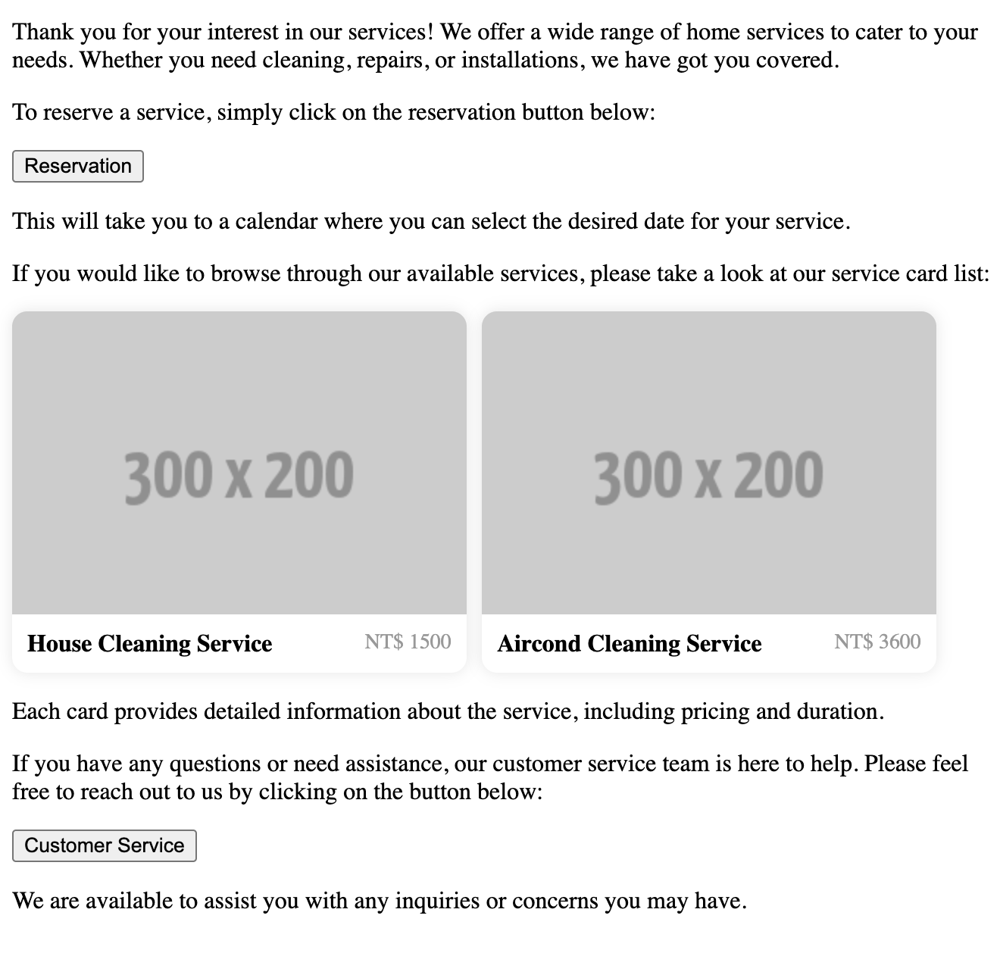

# @crazydos/vue-llm-rich-message
[繁體中文](./README.zh-tw.md)

Although `ChatGPT` generates Markdown messages, sometimes we may want to display more complex and customized content.

This tool leverages the capabilities of `Vue` to insert `slots` into Markdown through [`vue-markdown`](https://github.com/shunnNet/vue-markdown). With the addition of formatted instructions, it allows for a more diverse display of content generated by the language model in Markdown.



## install
```sh
npm i @crazydos/vue-llm-rich-message
```

## Usage
This is not a unified package but a combination of two tools. So, the following uses actual code to explain. Please follow the comments in order.

```vue
<script setup lang="ts">
// 1. `computeFormatHint` function and `ComponentMessage` component
import { computeFormatHint, ComponentMessage } from '@crazydos/vue-llm-rich-message'

import { ref } from 'vue'
import { openaiClient } from './fetch'
import ProductCardList from './components/ProductCardList.vue'

const content = ref(``)

// 2. Prepare component info for system message instruction. LLM will insert 1 or more components in appropriate position base on conversation.
const slotContents = [
  {
    component: 'reservation-button',

    // 2-1: IMPORTANT: description is important. You need tell the LLM what this component will show or do.
    // This can increase the possibility it put component in the right position.
    description: 'A reservation button, click to reserve service, after click, it will show a calendar to select date',
  },
  {
    component: 'service-card-list',
    description: 'A card list show all home services',
  },
  { component: 'customer-service-button', description: 'A Button to call customer service to help.' },
]

const productList = [
  { title: 'House Cleaning Service', price: 1500, image: 'https://fakeimg.pl/300x200/' },
  { title: 'Aircond Cleaning Service', price: 3600, image: 'https://fakeimg.pl/300x200/' },
]

// 3. Generate a component and format instruction for LLM
const formatInstruction = computeFormatHint(slotContents)

// 4. IMPORTANT: Combine with your systemMessage (or if you don't need customize system message, only put formatInstruction is OK)
const systemMessage = `You are a customer service, you are talking to a customer who wants to reserve a service, please help him to reserve a service.

${formatInstruction}
`

const info = ref('')
const generate = () => {
  info.value = 'loading...'

  // 5. Call your llm endpoint
  openaiClient('/chat/completions')
    .post({
      model: 'gpt-3.5-turbo',
      temperature: 0,
      messages: [
        // 6. With your system message
        { role: 'system', content: systemMessage },

        { role: 'user', content: 'Introduce your services, and where to contact with when I have problem' },
      ],
    })
    .json()
    .then((res) => {
      info.value = ''

      // 7. Then, we save the response message 
      content.value = res.data.value.choices[0].message.content
    })
}

const handleReservation = () => {
  window.alert('Reservation success')
}
const handleCS = () => {
  window.alert('Customer service success')
}
</script>

<template>
  <!-- 7. Pass llm markdown response to <ComponentMessage /> -->
  <ComponentMessage :message="content">

    <!--8. 
      IMPORTANT: Then customize your slot/component. 
      slot name will be the same with the `component` you pass to `computeFormatHint`
    -->
    <template #service-card-list>
      <ProductCardList :products="productList" />
    </template>
    <template #reservation-button>
      <button @click="handleReservation">Reservation</button>
    </template>
    <template #customer-service-button>
      <button @click="handleCS">Customer Service</button>
    </template>
  </ComponentMessage>
</template>
```

## Notice
- With version iterations, LLM may exhibit different behaviors for the same prompt, and different LLMs may react differently to the same prompt. If you find that the tool consistently does not produce the desired results for your prompt, you can refer to the contents of `prompt.ts` and write your own. This tool has been specifically designed to handle `ChatGPT`.

- To increase accuracy, it is recommended to set temperature to 0.

- Offering too many component choices to LLM may result in poor performance. (not sure)

## Setup example
An example is provided for you to try out in the `example` directory. You need to have an `OPENAI_API_KEY` and create a new `./example/.env` file. Inside, add the following:

```.env
VITE_OPENAI_API_KEY=your_api_key
```

Then you need to setup:

```sh
npm install

npm run dev
```

Then open `http://localhost:5173`, after you see the page, click `generate` button. And you will see the result after few seconds.

You will find an example of messages in `./example/src/App.vue`. You can toggle 1 of each comments to observe different results.

## reference
- [`vue-markdown`](https://github.com/shunnNet/vue-markdown)