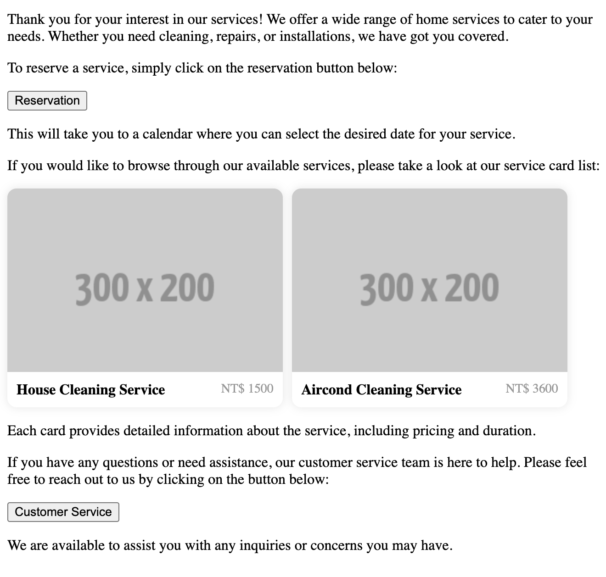

# @crazydos/vue-llm-rich-message
雖然 `ChatGPT` 會生成 markdown 訊息，但是有時候我們會希望顯示更複雜、更客製化的內容。

這個工具透過 [`vue-markdown`](https://github.com/shunnNet/vue-markdown) 提供 Vue 在 markdown 插入 slot 的能力，再達配格式化的 instruction，讓 LLM 生成的 markdown 顯示更多樣的內容。




## install
```sh
npm i @crazydos/vue-llm-rich-message
```

## Usage
這不是一體的套件，而是兩個工具的組合。所以以下使用實際的程式碼說明，請依序觀看 comment。

```vue
<script setup lang="ts">
// 1. `computeFormatHint` function and `ComponentMessage` component
import { computeFormatHint, ComponentMessage } from '@crazydos/vue-llm-rich-message'

import { ref } from 'vue'
import { openaiClient } from './fetch'
import ProductCardList from './components/ProductCardList.vue'

const content = ref(``)

// 2. Prepare component info for system message instruction. LLM will insert 1 or more components in appropriate position base on conversation.
const slotContents = [
  {
    component: 'reservation-button',
    
    // 2-1: IMPORTANT: description is important. You need tell the LLM what this component will show or do.
    // This can increase the possibility it put component in the right position.
    description: 'A reservation button, click to reserve service, after click, it will show a calendar to select date',
  },
  {
    component: 'service-card-list',
    description: 'A card list show all home services',
  },
  { component: 'customer-service-button', description: 'A Button to call customer service to help.' },
]

const productList = [
  { title: 'House Cleaning Service', price: 1500, image: 'https://fakeimg.pl/300x200/' },
  { title: 'Aircond Cleaning Service', price: 3600, image: 'https://fakeimg.pl/300x200/' },
]

// 3. Generate a component and format instruction for LLM
const formatInstruction = computeFormatHint(slotContents)

// 4. IMPORTANT: Combine with your systemMessage (or if you don't need customize system message, only put formatInstruction is OK)
const systemMessage = `You are a customer service, you are talking to a customer who wants to reserve a service, please help him to reserve a service.

${formatInstruction}
`

const info = ref('')
const generate = () => {
  info.value = 'loading...'

  // 5. Call your llm endpoint
  openaiClient('/chat/completions')
    .post({
      model: 'gpt-3.5-turbo',
      temperature: 0,
      messages: [
        // 6. With your system message
        { role: 'system', content: systemMessage },

        { role: 'user', content: 'Introduce your services, and where to contact with when I have problem' },
      ],
    })
    .json()
    .then((res) => {
      info.value = ''

      // 7. Then, we save the response message 
      content.value = res.data.value.choices[0].message.content
    })
}

const handleReservation = () => {
  window.alert('Reservation success')
}
const handleCS = () => {
  window.alert('Customer service success')
}
</script>

<template>
  <!-- 7. Pass llm markdown response to <ComponentMessage /> -->
  <ComponentMessage :message="content">

    <!--8. 
      IMPORTANT: Then customize your slot/component. 
      slot name will be the same with the `component` you pass to `computeFormatHint`
    -->
    <template #service-card-list>
      <ProductCardList :products="productList" />
    </template>
    <template #reservation-button>
      <button @click="handleReservation">Reservation</button>
    </template>
    <template #customer-service-button>
      <button @click="handleCS">Customer Service</button>
    </template>
  </ComponentMessage>
</template>
```

## Notice
- 隨著版本迭代，LLM 可能會對相同的 prompt 做出不同的行為，不同的 LLM 對相同的 prompt 也會有不同反應。如果你認為這個工具的 prompt 總是不出現你想要的結果，你也可以參考 `prompt.ts` 的內容，自己寫一個。這個工具只有特別針對 ChatGPT 做處理過。
- 為了增加準確度，建議將 `temperature` 調至 `0`
- 提供過多的 component 選擇給 llm 可能會導致表現不好，你可以試試看放到幾個符合你的需求。

## Setup example
有提供一個 example 可以玩玩看，在 example 目錄裡。你需要有 OPENAI_API_KEY，並新增 `./example/.env`，在裡頭加上：

```.env
VITE_OPENAI_API_KEY=your_api_key
```

然後你需要

```sh
npm install

npm run dev
```

然後用瀏覽器開啟 `http://localhost:5173`，並點擊 `generate` 按鈕。

你會在 `./example/src/App.vue` 中看到 messages 的範例，你可以開關他們的註解，查看不同的結果。

## reference
- [`vue-markdown`](https://github.com/shunnNet/vue-markdown)